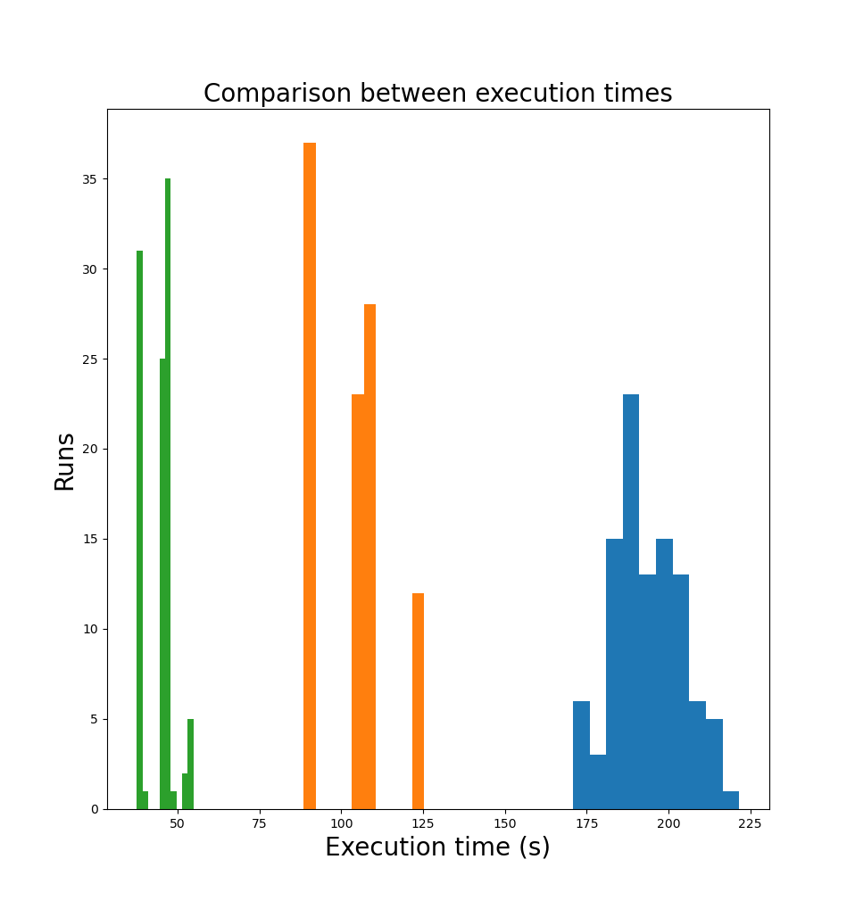

# Number recognition
This repository contains a neural network written from scratch in rust using the [nalgebra](https://nalgebra.rs/) crate.
It is part of a blog series currently in progress [here](https://max-amb.github.io).
You may find it useful to read the blogs if you hope to understand the code, otherwise I hope it is readable enough to be understood without them.

## Running 🏃
This project can currently only be run by using cargo:
```bash
git clone https://github.com/max-amb/number_recognition.git
cd number_recognition
cargo run
```

### Nix
If you are using nix there is no need to try install dependencies as they are all contained in the `flake.nix`.
You can enter this dev shell as follows:

```bash
git clone https://github.com/max-amb/number_recognition.git
cd number_recognition
nix develop
```

## Speed comparison with pytorch
The data for training runs can be found in `./benchmarking/`.
The tests were done utilising hyperfine utilising the following commands:
```bash
hyperfine --runs 100 "python3 main.py" --export-json ./py_results.json \
cd ../number_recognition/ \
hyperfine --runs 100 "./target/release/number_recognition" --export-json ./rust_results.json
```
and the `non_parallel_training` method was used for parity with the pytorch version.
The network that the models were tested on followed a $[728] \to [256] \to [10]$ architecure and utilised stochastic gradient descent and He initialisation.
The program exited when the accuracy on test data exceeded $96%$.
The test data was checked every epoch.
I have attempted to ensure all parameters in the models are the same but if you spot any disparity please email me or raise an issue.
Below is a graph displaying the results


## Testing data
This section hopes to detail how I obtained my testing data. If you are unsure of anything I recommend you read my blog post which walks through the mathematics!

### Initial conditions
We start with a network with 3 layers (one input, one hidden and one output).
They have sizes: 3, 2, and 3.
The weights look like this:

$$\omega^{[1]} = \begin{bmatrix} -0.75 & 0.5 & -0.25 \\\ 0.25 & -0.5 & 0.75 \end{bmatrix}$$

$$\omega^{[2]} = \begin{bmatrix}-0.75 & 0.75 \\\ 0.5 & -0.5 \\\ -0.25 & 0.25 \end{bmatrix}$$

Then we will have biases:

$$b^{[1]} = \begin{bmatrix} 0 \\\ 1 \end{bmatrix}$$

$$b^{[2]} = \begin{bmatrix} 0.75 \\\ 0.5 \\\ 0.25 \end{bmatrix}$$

We will have mock data:

$$\begin{bmatrix} 0.25 \\\  0.5 \\\ 0.75 \end{bmatrix}$$

and expect an output of

$$\begin{bmatrix} 0 \\\ 1 \\\ 0 \end{bmatrix}$$

For the activation functions, we use a leaky relu ($\alpha = 0.2$), denoted $ReLU$, for the hidden layers and a logistical sigmoid function, denoted $\sigma$, for the output layer.

Everything is shortened to 3 decimal points for conciseness, but the full output can be found in the wolfram outputs.

### Forward pass
Layer 1:

$$
\begin{aligned}
a^{[1]} & = ReLU((\omega^{[1]} \times a^{[0]}) + b^{[1]}) \\\
& = ReLU(\begin{bmatrix}-0.75 & 0.5 & -0.25 \\\ 0.25 & -0.5 & 0.75 \end{bmatrix} \times \begin{bmatrix} 0.25 \\\ 0.5 \\\ 0.75 \end{bmatrix} + \begin{bmatrix} 0 \\\ 1 \end{bmatrix})\\\
& =  \begin{bmatrix} -0.025 \\\ 1.375 \end{bmatrix}
\end{aligned}
$$

Layer 2:

$$
\begin{aligned}
a^{[2]} & = \sigma((\omega^{[2]} \times a^{[1]}) + b^{[2]}) \\\
& = \sigma(\begin{bmatrix}-0.75 & 0.75 \\\ 0.5 & -0.5 \\\ -0.25 & 0.25 \end{bmatrix} \times \begin{bmatrix} -0.025 \\\ 1.375 \end{bmatrix} + \begin{bmatrix} 0.75 \\\ 0.5 \\\ 0.25 \end{bmatrix})\\\
& =  \begin{bmatrix} 0.858 \\\ 0.450 \\\ 0.646 \end{bmatrix}
\end{aligned}
$$

### Backpropagation
#### Deltas for layer 2
$$
\begin{aligned}
\delta^{[2]} & = \nabla_a C \ \odot\ f'(z^{[2]}) \\\
& =  2 \ (\begin{bmatrix} 0.858 \\\ 0.450 \\\ 0.646 \end{bmatrix} - \begin{bmatrix} 0 \\\ 1 \\\ 0 \end{bmatrix}) \odot \begin{bmatrix} 0.858 (1-0.858) \\\ 0.450 (1-0.450) \\\ 0.646(1-0.646) \end{bmatrix} \\\
& = \begin{bmatrix} 0.209 \\\ -0.272 \\\ 0.295 \end{bmatrix}
\end{aligned}
$$

Wolfram input: `2 * ({(1/(1+e^{-1.8})),(1/(1+e^{0.2})),(1/(1+e^{-0.6}))} - {0,1,0}) * ({(1/(1+e^{-1.8}))*(1-(1/(1+e^{-1.8}))), (1/(1+e^{0.2}))*(1-(1/(1+e^{0.2}))), (1/(1+e^{-0.6}))*(1-(1/(1+e^{-0.6})))})`

Output: `{{0.208924}, {-0.272186}, {0.295432}}`

#### Biase derivatives for layer 2
$$
\frac{\partial C}{\partial b^{[2]}} = \delta^{[2]} = \begin{bmatrix} 0.209 \\\ -0.272 \\\ 0.295 \end{bmatrix}
$$

#### Weight derivatives for layer 2
$$
\begin{aligned}
\frac{\partial C}{\partial \omega^{[2]}} & = \delta^{[2]} {a^{[1]}}^T \\\
& = \begin{bmatrix} 0.209 \\\ -0.272 \\\ 0.295 \end{bmatrix} \begin{bmatrix} -0.025 & 1.375 \end{bmatrix} \\\
& = \begin{bmatrix} -0.005 & 0.287 \\\ 0.007 & -0.374 \\\ -0.007 & 0.406 \end{bmatrix}
\end{aligned}
$$

Wolfram input: `{{0.208924}, {-0.272186}, {0.295432}} * {{-0.025, 1.375}}`

Output: `{{-0.0052231, 0.287271}, {0.00680465, -0.374256}, {-0.0073858, 0.406219}}`

#### Deltas for layer 1
$$
\begin{aligned}
\delta^{[1]} & = ({\omega^{[2]}}^T \delta^{[2]}) \odot f'(z^{[1]})  \\\
& = (\begin{bmatrix} -0.75 & 0.5 & -0.25 \\\ 0.75 & -0.5 & 0.25 \end{bmatrix} \begin{bmatrix} 0.209 \\\ -0.272 \\\ 0.295 \end{bmatrix}) \otimes \begin{bmatrix} 0.2 \\\ 1 \end{bmatrix} \\\
& = \begin{bmatrix} -0.073 \\\ 0.367 \end{bmatrix} 
\end{aligned}
$$

Wolfram input: `({{-0.75, 0.5, -0.25}, {0.75, -0.5, 0.25}} * {{0.208924}, {-0.272186}, {0.295432}}) * {{0.2}, {1}}`

Output: `{{-0.0733288}, {0.366644}}`

#### Biase derivatives for layer 1
$$
\frac{\partial C}{\partial b^{[1]}} = \delta^{[1]} = \begin{bmatrix} -0.073 \\\ 0.367 \end{bmatrix} 
$$

#### Weight derivatives for layer 1
$$
\begin{aligned}
\frac{\partial C}{\partial \omega^{[1]}} & = \delta^{[1]} {a^{[0]}}^T \\\
& = \begin{bmatrix} -0.073 \\\ 0.367 \end{bmatrix} \begin{bmatrix} 0.25 & 0.5 & 0.75 \end{bmatrix} \\\
& = \begin{bmatrix} -0.018 & -0.037 & -0.055 \\\ 0.092 & 0.183 & 0.275 \end{bmatrix}
\end{aligned}
$$

Wolfram input: `{{-0.0733288}, {0.366644}} {{0.25, 0.5, 0.75}}`

Output: `{{-0.0183322, -0.0366644, -0.0549966}, {0.091661, 0.183322, 0.274983}}`
